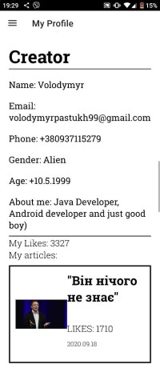

# Truth
##### "Truth" is a modern electronic newspaper, which makes voice of everyone citizen matter. All official media try to control information and our minds. So we have to destroy such system. 
>We will never be slave, but we will be journalists.

This program is built in MVP pattern and consists of two main parts. 
1. First part operates information of users.  
- includes such views as ***SignUp, Login, Verification, Change Password***.
- ***UserModel*** contains all business logic and manages connection to databse.
- Presenters carry out program login.
- uses shared preference for remember session

  

  

  

  

User can enter in app as guest, but if he want to write article, he have to sign up.
His data store in realtime database Firebase.
Authentication is by phone number.

2. Second part operates information of articles.
- includes views for writing articles, displaying articles and profiles of authors and others.
- ***ArticleModel*** contains business login
- Most of views include own presenter which carry out program logic

  

  

  

  

User can write own article or read others.
He can read articles by category, can rate article or watch authors profiles.
Article information is stored on Firebase realtime database.
Article images are contained on Firebase storage.

